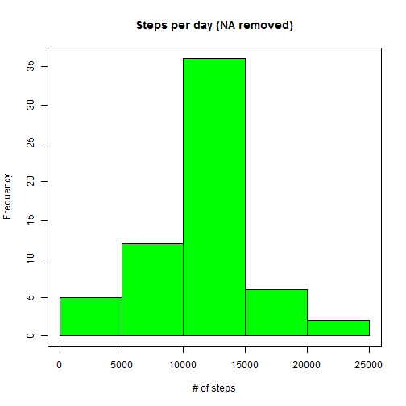
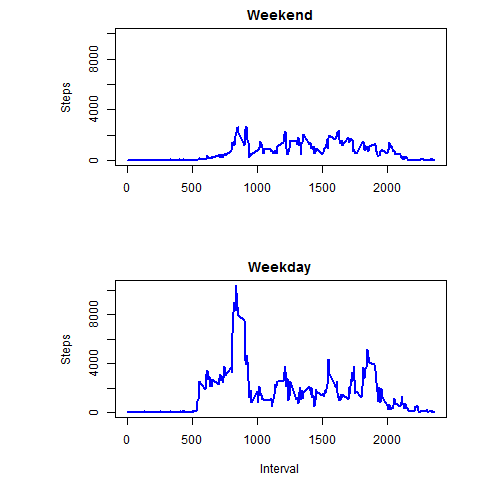

# Reproducible Research: Peer Assessment 1
1. set workdir
2. read CSV data 
3. remove NA
4. aggregate according to date
## Loading and preprocessing the data

```r
setwd("c://temp")
par(mfrow = c(1,1), mar=c(6,8,2,4) )
activity <- read.csv("activity.csv")
activity_nona <- na.omit(activity)
daysum<-aggregate(activity_nona$steps,by=list(activity_nona$date), FUN=sum)
```
## What is mean total number of steps taken per day?
5. histogram
6. calculate mean and median

```r
hist(daysum$x, main="Steps per day (NA removed)", col="blue", xlab="# of steps")
box()
```

 

```r
mean_act<-mean(daysum[,2])
mean_act
```

```
## [1] 10766
```

```r
median_act<-median(daysum[,2])
median_act
```

```
## [1] 10765
```
## What is the average daily activity pattern?
- This guy get up usually after 5am and sleep near midnight (maybe an IT guy :-)
- during 8:00am -9:30am walk a lot
- 8:35am is the highest number of steps : 10927

7. aggregate according to 5 min time interval
8. plot

```r
timesum<-aggregate(activity_nona$steps,by=list(activity_nona$interval), FUN=sum)
plot(timesum[,1],timesum[,2],type="l",main="Steps by Time",xlab="Time", ylab="Steps", col="dark red")
```

 


## Imputing missing values


```r
missingvalues = dim(activity)[1]-dim(activity_nona)[1]
missingvalues
```

```
## [1] 2304
```
## Are there differences in activity patterns between weekdays and weekends?
9. use ddply
10. define a function impute.mean to calculate the mean without NA.
11. ddply the activity dataset according to 5 min interval and pass to the function impute mean and replace NA with the mean
12. re-aggregate according to date and calculate mean and median and make a plot

- No difference on average daily steps as NA are replaced by average number
13. as.POSIXlt covert date to weekday (from 0 to 6)
14. if weekday%%6==0 mean weekday is 0 or 6, which means Sunday or Saturday, in other words: Weekend
15. subset data according to weekday and weekend
16. re-aggregate according to interval and plot

- obviously, weekend and weekday pattern is different. seem not much walk on weekends.


```r
library("plyr")
impute.mean <- function(x) replace(x, is.na(x), mean(x, na.rm = TRUE))
activity1 <- ddply(activity, ~interval, transform, steps  = impute.mean(steps))

daysum1<-aggregate(activity1$steps,by=list(activity1$date), FUN=sum)
hist(daysum1$x, main="Steps per day (NA removed)", col="green", xlab="# of steps")
box()
```

 

```r
mean_act1<-mean(daysum1[,2])
mean_act1
```

```
## [1] 10766
```

```r
median_act1<-median(daysum1[,2])
median_act1
```

```
## [1] 10766
```

```r
weekday <- as.POSIXlt(as.Date(activity1$date))$wday
activity1$weekend <- (weekday%%6==0)

par(mfrow = c(2,1), mar=c(6,8,2,4) )

activity_weekend <- subset(activity1,weekend==TRUE)
activity_weekday <- subset(activity1,weekend==FALSE)

timesum_weekend<-aggregate(activity_weekend$steps,by=list(activity_weekend$interval), FUN=sum)
plot(timesum_weekend[,1],timesum_weekend[,2],type="l",main="Weekend", ylab="Steps", col="blue", lwd=2, xlab="", ylim=c(0,10000))

timesum_weekday<-aggregate(activity_weekday$steps,by=list(activity_weekday$interval), FUN=sum)
plot(timesum_weekday[,1],timesum_weekday[,2],type="l",main="Weekday",xlab="Interval", ylab="Steps", col="blue", lwd=2)
```

 


